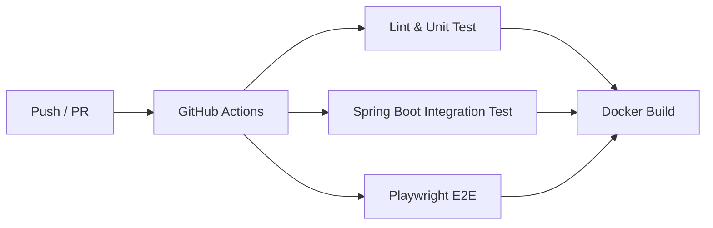

# Soma Pages – ポートフォリオ兼ヘッドレス CMS サンプル


## 0. このリポジトリについて

本リポジトリは **Next.js × Spring Boot × PostgreSQL** を用いて構築したフルスタック Web アプリケーションのサンプルです。就職活動のポートフォリオとして、以下のポイントを示すことを目的としています。

* **モダンなフロントエンド開発**（Next.js 15 App Router / React 18 / Tailwind CSS）
* **堅牢なバックエンド設計**（Spring Boot 3 / JWT 認証 / RBAC）
* **Docker による環境統一 & クラウドデプロイ**
* **CI / テスト自動化**（GitHub Actions / JUnit / Playwright）

> 🌱 **個人開発でも「チーム開発で通用する設計・運用」を意識**していることをアピールできます。

---

## 1. 主要機能

| 分類 | 機能 | 技術 | 実装状況 |
|------|------|------|----------|
| 認証 | メール & パスワードでログイン | Spring Security / JWT | ✅ 完了 |
| 認可 | `ADMIN` / `USER` 役割による RBAC | `@PreAuthorize` | ✅ 完了 |
| コンテンツ管理 | 記事 CRUD API | Spring Data JPA | ✅ 完了 |
| 管理 UI | 記事一覧 / 作成 / 編集フォーム | Next.js + Tailwind | ✅ 完了 |
| テスト | 統合テスト (JUnit) / E2E (Playwright) | Testcontainers 他 | ✅ 完了 |
| CI | フロント / バック / E2E 並列実行 | GitHub Actions | ✅ 完了 |
| セキュリティ強化 | HttpOnly Cookie 認証 | Spring Security | ⏳ 予定 (BE-07) |
| CD | Docker イメージ GHCR Push | GitHub Actions | ⏳ 予定 (CD-01) |
| 運用 | HTTPS リバースプロキシ (Nginx) | Traefik or Nginx | ⏳ 予定 (OPS-01) |

---

## 2. 技術スタック

### フロントエンド
* Next.js 15 (App Router)
* React 18 / TypeScript 5.7
* Tailwind CSS 3.4
* Playwright + Vitest

### バックエンド
* Spring Boot 3.3
* Spring Security + JWT
* PostgreSQL 15
* Flyway による DB マイグレーション
* Testcontainers / JUnit5

### インフラ & DevOps
* Docker / Docker Compose
* GitHub Actions (Lint → Build → Test → E2E → Docker Build)
* Google Cloud VM (Ubuntu 24.04) へデプロイ（手動 Pull）

---

## 3. クイックスタート

### 3-1. ローカル環境
```bash
# リポジトリ取得
$ git clone https://github.com/yourname/soma-pages.git && cd soma-pages

# 依存関係インストール
$ npm i  # フロント
$ ./mvnw clean package -DskipTests  # バック

# 環境変数を用意
$ cp env.example.txt .env  # プレースホルダーを書き換えてください

# コンテナ一発起動 (フロント + バック + DB)
$ docker compose up -d
```

* フロントエンド: <http://localhost:3000>
* バックエンド API: <http://localhost:8080/api>

### 3-2. 本番 (VM / サーバー)
```bash
# VM で初回のみ
$ git pull origin develop
$ docker compose -f docker-compose.prod.yml pull  # GHCR Push 済みの場合
$ docker compose -f docker-compose.prod.yml up -d
```
必要な環境変数は **Secret Manager / GitHub Secrets** などで注入してください。

---

## 4. システム構成図
```
[Next.js]  ──>  /api/proxy/*  ─┐
                             │ (内部通信)
[Spring Boot] ──> PostgreSQL ─┘
```
* Nginx / Traefik 終端 (OPS-01 完了後) で HTTPS → 80/8080 へリバースプロキシ予定

---

## 5. テスト & CI


すべてグリーンになれば main/develop へマージ可能というゲートを設定。

---

## 6. 今後のロードマップ (tasks.md 抜粋)
* **BE-07:** JWT を HttpOnly Cookie で配信し、XSS 耐性を強化
* **CD-01:** Docker イメージを GHCR へ自動 Push、サーバー側は `docker compose pull` → `up -d` でローリング更新
* **OPS-01:** Nginx / Traefik + Let's Encrypt で HTTPS 自動更新
* **CI-01:** OWASP Dependency-Check による脆弱性スキャンジョブ

---

## 7. ライセンス
本リポジトリは MIT ライセンスの下で公開されています。

<!-- UI スクリーンショット -->
## サンプル UI スクリーンショット

| 画面 | スクリーンショット |
|------|-------------------|
| ブログ一覧 |  |
| ログインフォーム |  |
| 記事編集フォーム |  |
