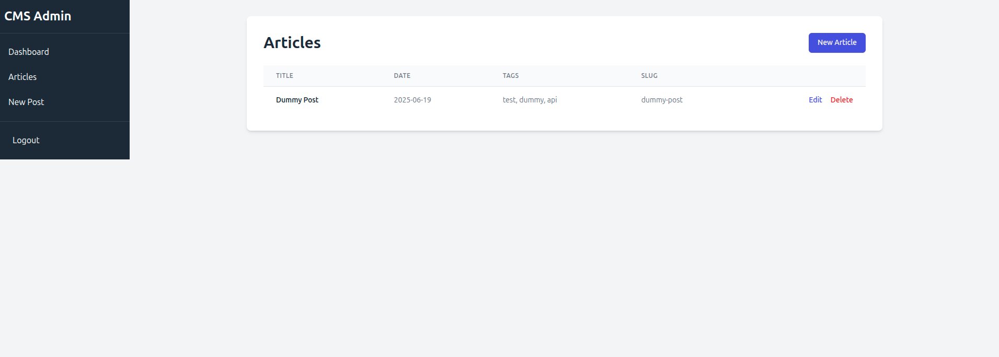
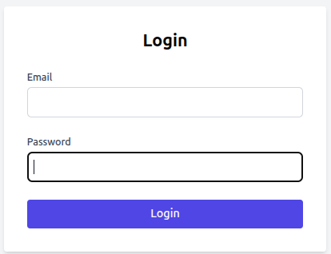
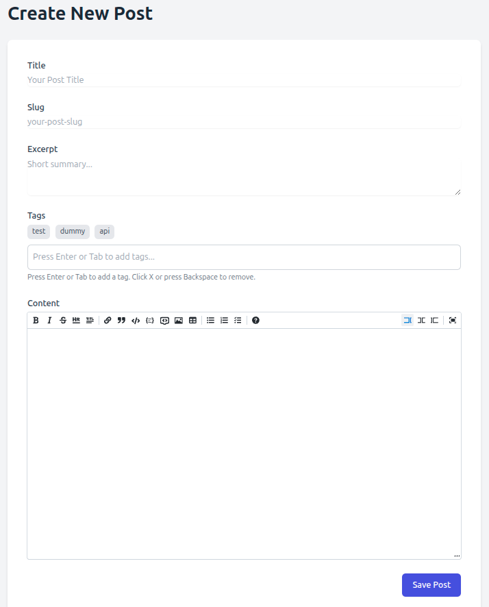
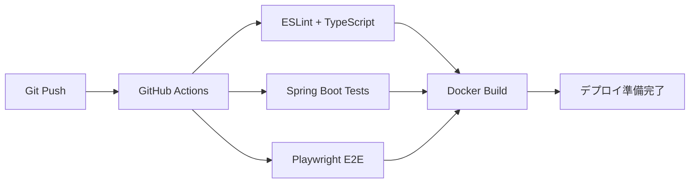

# Soma Pages – フルスタックWebアプリケーション

> **Next.js × Spring Boot × PostgreSQL** で構築した本格的なポートフォリオ兼CMS

## 🎯 アプリケーション画面

<div align="center">

### ブログ一覧画面


### 管理画面 - ログイン


### 管理画面 - 記事編集


</div>

---

## 🚀 プロジェクト概要

本プロジェクトは **就職活動のポートフォリオ** として、モダンな技術スタックを用いて開発したフルスタックWebアプリケーションです。

### 💡 開発コンセプト
* **個人開発でもチーム開発で通用する設計・運用を実践**
* **モダンなフロントエンド技術の習得と実装**
* **セキュアで保守性の高いバックエンド設計**
* **CI/CD・テスト自動化による品質保証**

---

## ⚡️ 主要機能・実装状況

| カテゴリ | 機能 | 技術・手法 | ステータス |
|---------|------|------------|------------|
| **認証** | JWT認証・ログイン | Spring Security + JWT | ✅ **完了** |
| **認可** | ロールベースアクセス制御 | `@PreAuthorize` / RBAC | ✅ **完了** |
| **CMS** | 記事CRUD API | Spring Data JPA | ✅ **完了** |
| **管理UI** | 記事一覧・作成・編集 | Next.js + Tailwind CSS | ✅ **完了** |
| **管理UI** | フィルタリング・検索機能 | React State Management | 🚧 **実装予定** |
| **テスト** | 統合テスト・E2Eテスト | JUnit + Playwright | ✅ **完了** |
| **CI** | 自動テスト・ビルド | GitHub Actions | ✅ **完了** |
| **セキュリティ** | HttpOnly Cookie認証 | Spring Security | 📋 **予定 (BE-07)** |
| **DevOps** | Docker自動デプロイ | GHCR + Docker Compose | 📋 **予定 (CD-01)** |

---

## 🛠 技術スタック

### **フロントエンド**
```
Next.js 15 (App Router) + React 18 + TypeScript 5.7
Tailwind CSS 3.4 + Playwright E2E + Vitest
```

### **バックエンド**  
```
Spring Boot 3.3 + Spring Security + JWT
PostgreSQL 15 + Flyway Migration
JUnit5 + Testcontainers
```

### **インフラ & DevOps**
```
Docker + Docker Compose
GitHub Actions (Lint → Test → E2E → Build)
Google Cloud VM (Ubuntu 24.04)
```

---

## 🏗 システム構成

```
┌─────────────┐    ┌──────────────┐    ┌─────────────┐
│   Next.js   │───▶│ Spring Boot  │───▶│ PostgreSQL  │
│  (Port:3000)│    │  (Port:8080) │    │ (Port:5432) │
└─────────────┘    └──────────────┘    └─────────────┘
       │                    │
       └── /api/proxy/* ─────┘ (内部通信)
```

**今後の拡張予定**: Nginx/Traefik終端でHTTPS化 + リバースプロキシ

---

## 🚦 クイックスタート

### ローカル開発環境
```bash
# 1. リポジトリクローン
git clone https://github.com/yourname/soma-pages.git
cd soma-pages

# 2. 依存関係インストール
npm install                              # フロントエンド
./mvnw clean package -DskipTests        # バックエンド

# 3. 環境変数設定
cp env.example.txt .env
# .envファイルを編集してください

# 4. アプリケーション起動
docker compose up -d
```

### アクセス先
- **フロントエンド**: http://localhost:3000
- **バックエンド API**: http://localhost:8080/api
- **管理画面**: http://localhost:3000/admin

---

## 🧪 テスト・品質保証

### CI/CDパイプライン


### テストカバレッジ
- **フロントエンド**: Vitest + React Testing Library
- **バックエンド**: JUnit5 + Testcontainers + MockMvc
- **E2E**: Playwright (ブラウザ自動化テスト)

---

## 📈 今後のロードマップ

### **近日実装予定**
- **BE-07**: JWT → HttpOnly Cookie移行 (XSS対策強化)
- **FE-08**: 管理画面フィルタリング・検索機能
- **CD-01**: GitHub Container Registry自動デプロイ

### **中長期計画**
- **OPS-01**: Nginx + Let's Encrypt HTTPS自動更新
- **CI-02**: OWASP依存関係脆弱性スキャン
- **PERF-01**: Redis導入でパフォーマンス最適化

---

## 👨‍💻 開発者アピールポイント

### **技術的な強み**
- ✅ モダンなReact開発（App Router, Server Components）
- ✅ Spring Bootでのセキュアな API設計
- ✅ Docker によるポータブルな開発環境構築
- ✅ CI/CD パイプラインの設計・運用経験

### **チーム開発への対応力**
- ✅ Git Flow による効率的なブランチ戦略
- ✅ 自動テストによる品質保証の仕組み
- ✅ 技術選定の根拠を明確にした設計判断
- ✅ 保守性を意識したコード品質の維持

---

## 📄 ライセンス

MIT License - 詳細は [LICENSE](LICENSE) ファイルをご確認ください。

