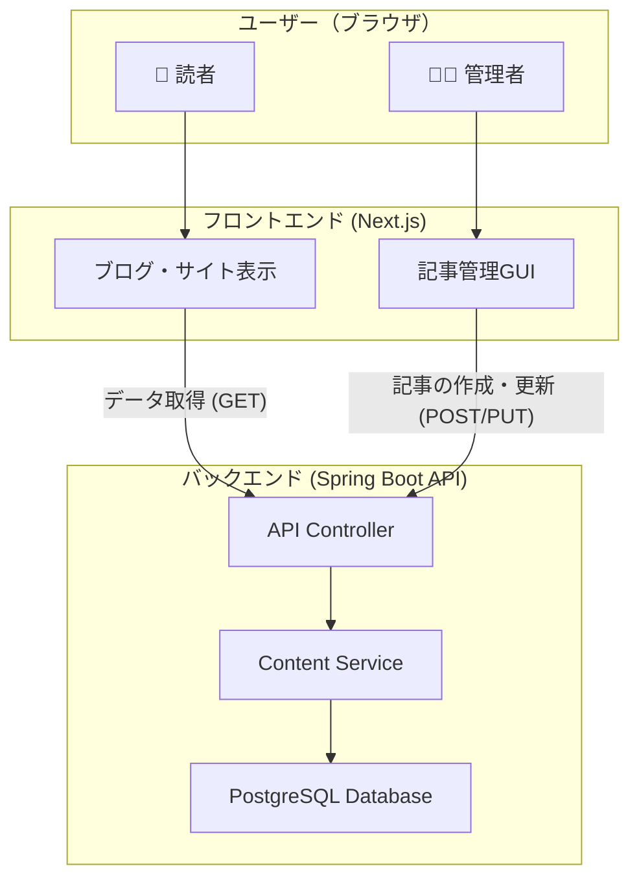

# プロジェクト設計ドキュメント (Project Design Document)

**バージョン:** 1.0
**最終更新日:** `[自動挿入: YYYY-MM-DD]`

## 1. プロジェクト概要 (Project Overview)

本プロジェクトは、既存のNext.js製静的サイトに、Spring Boot製のバックエンドAPIサーバーを追加し、ヘッドレスCMSアーキテクチャへ移行することを目的とする。

これにより、以下の価値を提供する:
- **GUIによるコンテンツ管理:** 管理者がブラウザから直感的に記事を作成・編集できる機能。
- **データ永続化:** コンテンツは従来通りマークダウンファイルとしてファイルシステムに保存され、Gitによるバージョン管理を可能にする。
- **将来的な拡張性:** 他のプロジェクト（クイズアプリ等）にも転用可能な、再利用性の高いバックエンドを構築する。
- **統一された開発環境:** DockerとVSCode Dev Containerを用いて、誰でも1コマンドで開発環境を構築できる状態を目指す。

## 2. アーキテクチャ (Architecture)

### 2.1. 全体像

ヘッドレスCMSアーキテクチャを採用する。

- **フロントエンド:** Next.js。Vercelへのデプロイを想定。コンテンツの表示と管理者向けUIを提供する。
- **バックエンド:** Spring Boot。コンテンツ（マークダウンファイル）を管理するREST APIを提供する。Dockerコンテナとして実行される。

### 2.2. バックエンド設計思想 (Backend Design Philosophy)

- **Stateless:** サーバーは状態を持たない。リクエストごとに完結した処理を行う。
- **汎用性 (Genericity):** 特定のコンテンツ（例: `article`）に依存しない設計を目指す。「コンテンツ」という抽象的な概念を扱い、将来的には`quiz`や`document`など、様々な種類のコンテンツを同じ仕組みで管理できるようにする。
- **設定可能性 (Configurability):** コンテンツを保存するファイルパスなどの環境依存の設定は、`application.properties`や環境変数を通じて外部から注入できるようにする。

### 2.3. Gitブランチ戦略 (Git Branching Strategy)

**GitHub Flow**を基本とする。

- **`main`:** 常にデプロイ可能な安定ブランチ。
- **`feature/{ticket-id}-{description}`:** 機能開発や修正を行うブランチ。`main`から作成する。
    - 例: `feature/BE-01-setup-springboot-project`
    - 例: `feature/FE-02-create-admin-layout`
- Pull Requestは、必ず1名以上のレビューを経てから`main`にマージする。

## 3. 技術スタックとライブラリ (Tech Stack & Libraries)

AI（アシスタント）は、実装前に必ずこれらのドキュメントを参照し、最新のバージョンや使い方を確認すること。

### 3.1. バックエンド (Spring Boot)
- **Java:** 17 or later
- **Spring Boot:** 3.x
- **依存ライブラリ:**
    - `spring-boot-starter-web`: REST API構築用 ([ドキュメント](https://docs.spring.io/spring-boot/docs/current/reference/html/web.html))
    - `spring-boot-starter-data-jpa`: データベース永続化用 ([ドキュメント](https://docs.spring.io/spring-boot/docs/current/reference/html/data.html#data.sql.jpa-and-spring-data))
    - `postgresql`: PostgreSQL JDBCドライバ
    - `lombok`: ボイラープレートコード削減 ([ドキュメント](https://projectlombok.org/features/all))
- **ビルドツール:** Maven

### 3.2. フロントエンド (Next.js)
- **Node.js:** 18.x or later
- **Next.js:** 14.x or 15.x ([ドキュメント](https://nextjs.org/docs))
- **React:** 18.x ([ドキュメント](https://react.dev/))
- **TypeScript**
- **UI:**
    - `tailwindcss`: スタイリング ([ドキュメント](https://tailwindcss.com/docs/))
    - `lucide-react`: アイコン ([ドキュメント](https://lucide.dev/guide/packages/lucide-react))
- **Markdownエディタ (候補):**
    - `react-markdown` + `remark-gfm`: 表示用 ([ドキュメント](https://github.com/remarkjs/react-markdown))
    - `easymde`: 編集用エディタ ([ドキュメント](https://github.com/Ionaru/easy-markdown-editor))
    - `@uiw/react-md-editor`: 編集用エディタ ([ドキュメント](https://uiwjs.github.io/react-md-editor/))

## 4. 開発環境 (Development Environment)

- **コンテナ技術:** Docker, Docker Compose
- **開発環境統一:** VSCode Dev Container
- **設定ファイル:**
    - `docker-compose.yml`: `frontend`と`backend`サービスを定義。
    - `.devcontainer/devcontainer.json`: Dev Containerの設定。
    - `backend/Dockerfile`: Spring Bootアプリのイメージ定義。
    
これにより、リポジトリをクローンし、VSCodeで「Reopen in Container」を実行するだけで、必要なツールがすべてインストールされた状態で開発を開始できる。 